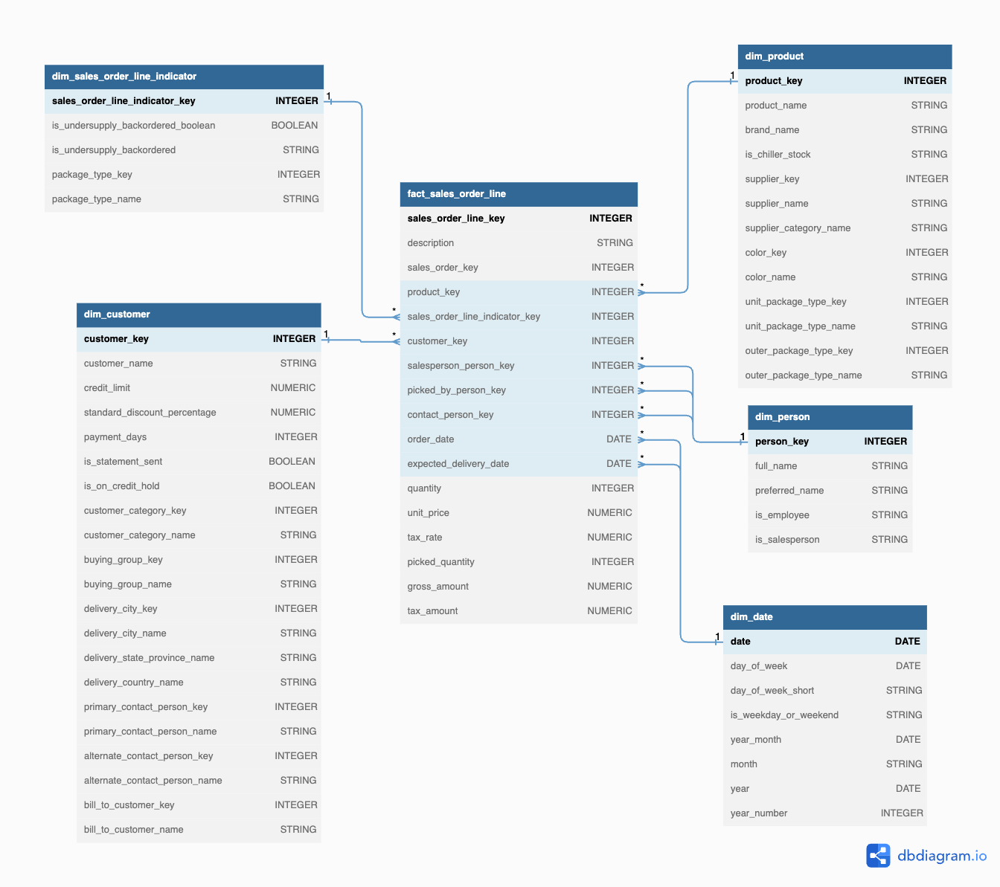

# Data Warehouse Project

## 💥 About

Hello! I'm Lam, and this is my project to learn how to create a data warehouse. In this project, I've followed Kimball's modeling techniques.

Techstacks that I used in this project:
- ELT tool: dbt
- Visualization: MS Power BI
- Data Lake, Data Warehouse: Google BigQuery

## 🎯 Knowledge & techniques that I achieved

- Building a Data Warehouse from scratch
- Designing data models following [Kimball's Dimensional Modeling techniques](https://www.goodreads.com/en/book/show/748203)
- Implementing end-to-end data pipeline using [DBT](https://www.getdbt.com/) and SQL
- Implementing data quality checks using [DBT test](https://docs.getdbt.com/docs/build/tests)

## ⚒️ Modules that I implemented

- Sales Orders
- Purchase Orders
- Purchase Orders Snapshot

## 🚀 How to check this project

- You can download the final report at [`Wide World Importers v2_Import.pbix`](./pbix/Wide%20World%20Importers%20v2_Import.pbix).
- You can find the diagrams at [`diagrams`](./diagrams).
- You can find data models at [`models/analytics`](./models/analytics).
- You can find data quality tests inside the `yml` files at [`models/analytics`](./models/analytics).

**Quick look on the report:**

**Sales order line ERD:**

**Purchase order line ERD:**

## More info
- Raw dataset: [Wide World Importers](https://learn.microsoft.com/en-us/sql/samples/wide-world-importers-what-is?view=sql-server-ver16)
- Database: [BigQuery](https://cloud.google.com/bigquery)
- Course: [Data Warehouse by Vitlamdata](https://vitlamdata.substack.com/p/khoa-hoc-xu-ly-du-lieu-cho-data-warehouse)
